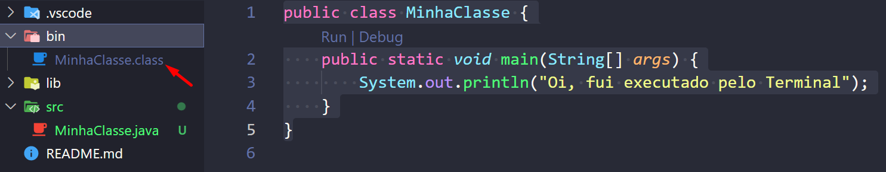
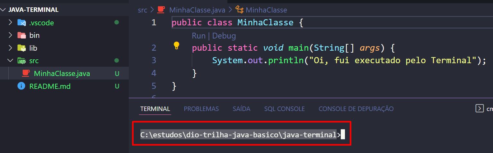
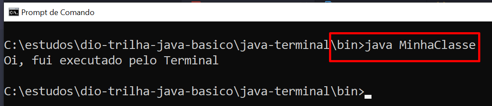
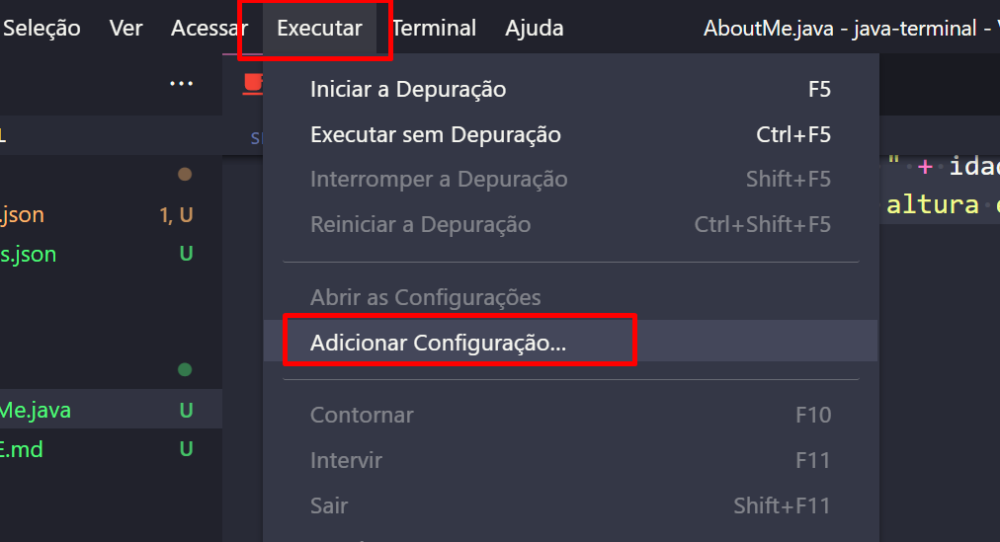
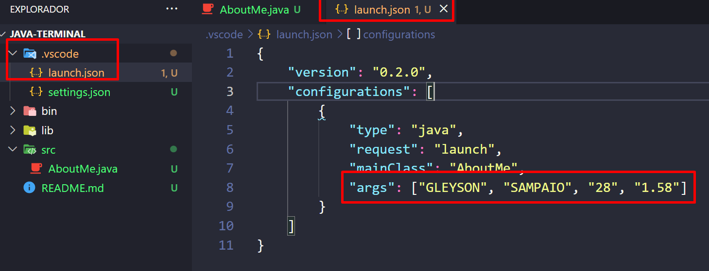

# Terminal e Argumentos
Nem sempre executamos nosso programa Java pela IDE, já pensou nossos clientes tendo que instalar o Eclipse ou VsCode para rodar o sistema em sua empresa ?

Com a JVM devidamente configurada, nós podemos criar um executável do nosso programa e disponibilizar o instalador para qualquer sistema operacional.

No nosso caso iremos aprender como executar um programa Java via terminal como MS - DOS ou terminal do VsCode.

## Objetivo
Explorar opções de entrada e saída de de dados em uma aplicação java.
## Assuntos
- main args
- Scanner
- Execução via IDE
- Execução via prompt de comando

## 📂 Comandos CMD para Criar, Abrir e Ler Documentos

## 📌 Criar Arquivos
| Comando | Descrição | Exemplo |
|---------|-----------|---------|
| `echo`  | Cria um arquivo de texto com conteúdo. | `echo Olá, mundo! > arquivo.txt` |
| `type nul >` | Cria um arquivo vazio. | `type nul > documento.txt` |
| `copy con` | Cria e edita um arquivo no CMD (pressione `Ctrl + Z` e `Enter` para salvar). | `copy con arquivo.txt` |

---

## 📌 Abrir Arquivos
| Comando | Descrição | Exemplo |
|---------|-----------|---------|
| `start` | Abre um arquivo no programa padrão. | `start arquivo.txt` |
| `notepad` | Abre um arquivo no **Bloco de Notas**. | `notepad arquivo.txt` |
| `wordpad` | Abre um arquivo no **WordPad**. | `wordpad documento.rtf` |

---

## 📌 Ler Arquivos no CMD
| Comando | Descrição | Exemplo |
|---------|-----------|---------|
| `type` | Exibe o conteúdo de um arquivo de texto. | `type arquivo.txt` |
| `more` | Exibe arquivos longos página por página. | `more arquivo.txt` |

---

## 📌 Manipular Arquivos
| Comando | Descrição | Exemplo |
|---------|-----------|---------|
| `del` | Exclui um arquivo. | `del arquivo.txt` |
| `ren` | Renomeia um arquivo. | `ren arquivo.txt novo_nome.txt` |
| `copy` | Copia um arquivo para outro local. | `copy arquivo.txt C:\Backup\` |
| `move` | Move um arquivo para outra pasta. | `move arquivo.txt C:\Documentos\` |

## O comando `cd` (Change Directory) permite navegar entre diretórios no Prompt de Comando.

## 📌 Usos do `cd`
| Comando | Descrição | Exemplo |
|---------|-----------|---------|
| `cd NomeDaPasta` | Entra em uma pasta dentro do diretório atual. | `cd Documentos` |
| `cd ..` | Volta um nível na hierarquia de diretórios. | `cd ..` |
| `cd \` | Volta diretamente para o diretório raiz (C:\). | `cd \` |
| `cd /d Letra:\Caminho` | Muda para outro disco e caminho ao mesmo tempo. | `cd /d D:\Projetos` |

---

## 📌 Exemplos Práticos
### 🔹 **1. Acessando uma pasta específica**
Se você estiver no diretório `C:\Users\Usuario\` e quiser entrar na pasta `Documentos`, use:
```cmd
cd Documentos
```

### Exemplo
Vamos criar uma classe chamada MinhaClasse.java com o código abaixo:

```java
public class MinhaClasse {
    public static void main(String[] args) {
        System.out.println("Oi, fui executado pelo Terminal");
    }
}
```
> Observe que nosso projeto Java criado por um IDE, ele terá uma pasta chamada bin. É nesta pasta que ficarão os arquivos **.class**, o nosso `bytecode`.




Mesmo usando uma IDE, nós sempre precisaremos identificar aonde se encontram as classes do nosso projeto, no meu caso está em: C:\estudos\dio-trilha-java-basico\java-terminal.



## Terminal
Vamos ilustrar como executar uma classe, depois de compilada, sem precisar usar a IDE.

1. Abra o MS-DOS(CMD) ou Power Shell;
2. Localize o diretório do seu projeto: 
    - **cd C:\estudos\dio-trilha-java-basico\java-terminal**
3. Acesse a pasta *bin:* 
    - **cd bin**
4. Agora digite o comando:
    - `java MinhaClasse` (nome da classe sem usar a extensão **.class**)



# Argumentos
Quando executamos uma classe que contenha o método main, o mesmo permite que passemos um array `[]` de argumentos do tipo String. Logo podemos após a definição da classe a ser executada informar estes parâmetros, exemplo:
> `java MinhaClasse agumentoUm argumentoDois`

Exemplo

> Ao executar é necessário informar os parametros dos atributos
- nome
- sobrenome
- idade
- altura

```java
public class AboutMe {
    public static void main(String[] args) {
        //os argumentos começam com indice 0
        String nome = args [0];
        String sobrenome = args [1];
        int idade = Integer.valueOf(args[2]); //vamos falar sobre Wrappers
        double altura = Double.valueOf(args[3]);

        System.out.println("Ola, me chamo " + nome + " " + sobrenome);
        System.out.println("Tenho " + idade + " anos ");
        System.out.println("Minha altura é " + altura + "cm ");
    }
}
```

## Passando valores aos argumentos pelo VsCode.
1. Passo 1:

2. Passo 2:


```java
{
    "version": "0.2.0",
    "configurations": [
        {
            "type": "java",
            "request": "launch",
            "mainClass": "AboutMe",
            "args": ["GLEYSON", "SAMPAIO", "28", "1.58"]
        }
    ]
}

```

Executando o programa agora no terminal

```
cd C:\estudos\dio-trilha-java-basico\java-terminal
cd bin

java AboutMe GLEYSON SAMPAIO 28 1.58

```

# Scanner

Nos exemplos anteriores percebemos que podemos receber dados digitados pelo usuário do nosso sistema, porém tudo precisa estar em uma linha e também é necessário informar os valores nas posições correspondentes. Esta abordagem pode deixar margens de execução com erro do nosso programa. Para isso, com a finalidade de deixar as nossas entradas de dados mais seguras agora vamos receber estes dados via **Scanner**.

A classe **Scanner** permite que o usuário tenha uma interação mais assertiva com o nosso programa, veja como vamos mudar o nosso programa **AboutMe** para deixar mais intuitivo aos usuários.

```java
import java.util.Locale;
import java.util.Scanner;

public class AboutMe {
    public static void main(String[] args) {
        //criando o objeto scanner
        Scanner scanner = new Scanner(System.in).useLocale(Locale.US);
        
        System.out.println("Digite seu nome");
        String nome = scanner.next();
        
        System.out.println("Digite seu sobrenome");
        String sobrenome = scanner.next();

        System.out.println("Digite sua idade");
        int idade = scanner.nextInt();
        
        System.out.println("Digite sua altura");
        double altura = scanner.nextDouble();

        
        //imprimindo os dados obtidos pelo usuario
        System.out.println("Ola, me chamo " + nome + " " + sobrenome);
        System.out.println("Tenho " + idade + " anos ");
        System.out.println("Minha altura é " + altura + "cm ");
        
        
    }
}
```
[Debugging vscode](https://code.visualstudio.com/docs/java/java-debugging)

[Pass parameters](https://linuxtut.com/pass-parameters-when-debugging-vscode-java.-note-462e0/)

## Questao da atividade explicada:

```java
public class Teste {
        
    public static void main(String[] args)         
    throws Exception {
        int num = 1;
        String num2 = "2";
        System.out.println(num+num2);
    
    } {

    }
}
```

`public` → O método é acessível de qualquer lugar.

`static` → Pertence à classe e pode ser executado sem criar um objeto.

`void` → Não retorna nenhum valor.

`main(String[] args)` → Método principal, onde o programa começa a execução.

`throws Exception` → Indica que o método pode lançar exceções do tipo Exception, mas neste caso, não há código que gere uma exceção